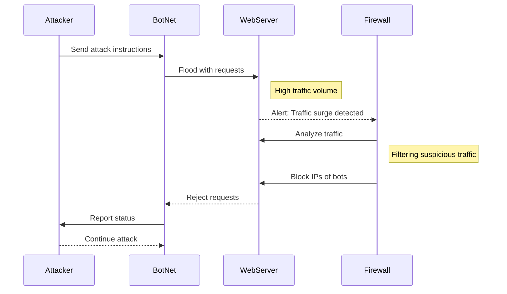

# DDoS Attack Sequence Diagram

## Documentation Section
The steps involved in a Distributed Denial of Service (DDoS) assault on a web server belonging to a company are described in this article. The attacker, the compromised bots, the targeted server, and the defensive measures in place are all represented in the diagram. 