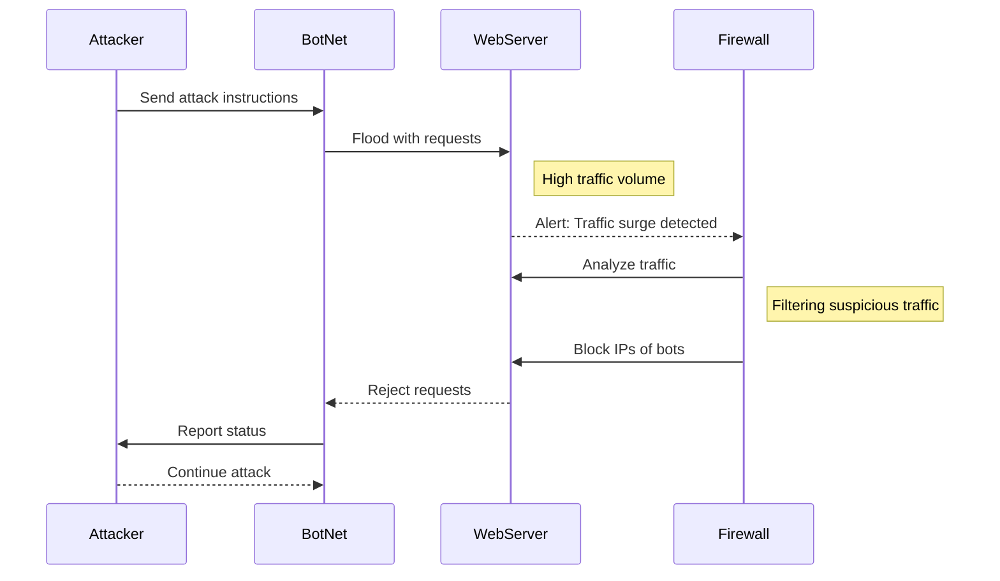

# DDoS Attack Sequence Diagram

## Documentation Section
The Attacker, who starts the attack, the Compromised Bot, which stands in for the bots making requests, the Target, which becomes overwhelmed, and the Firewall, which serves as the defense mechanism in response to the attack, are the four main elements in this sequence diagram. The Attacker gives the Bot the order to launch the attack first. The Bot then makes several queries to the Server. The increased requests cause the server to become overloaded. The Firewall receives excessive traffic, which the Server notifies it of. The Firewall analyzes the traffic and labels it as harmful. In order to safeguard the server, the firewall then denies the malicious requests.