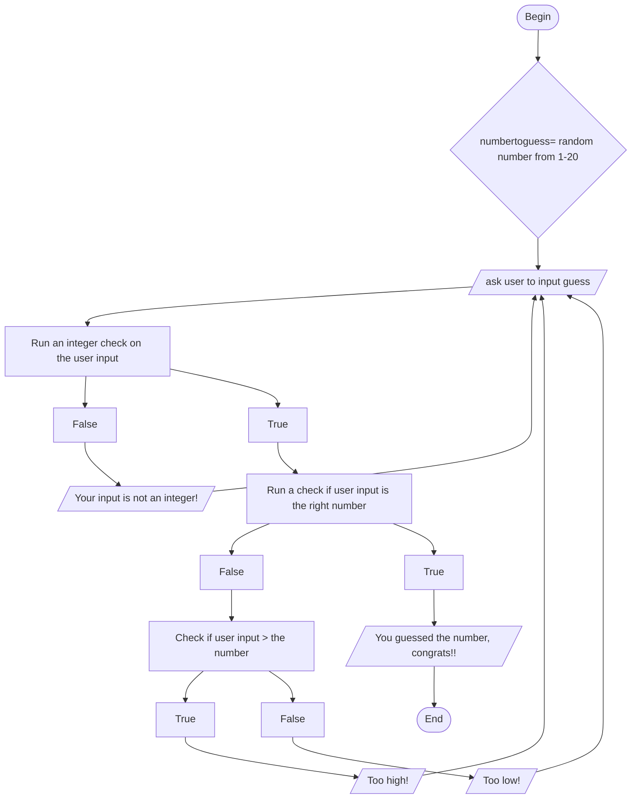

## Guessing Game

```mermaid
flowchart TD
Start([Begin])
Start --> RanNum{numbertoguess= random number from 1-20}
RanNum --> user_input[/ask user to input guess/]
user_input --> intcheck[Run an integer check on the user input]
intcheck --> int_false[False]
int_false --> outfal[/Your input is not an integer!/] --> user_input
intcheck --> int_true[True] --> numcheck[Run a check if user input is the right number]
numcheck --> incor[False]
incor --> hicheck[Check if user input > the number]
hicheck --> hitrue[True] --> too_high[/Too high!/]
too_high --> user_input
hicheck --> hiflase[False] --> too_low[/Too low!/] --> user_input
numcheck --> numtru[True]
numtru --> isnum[/You guessed the number, congrats!!/]
isnum --> End([End])

```