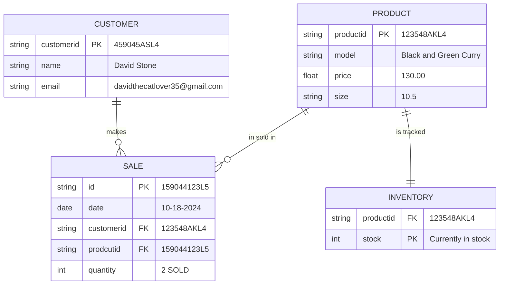

# Nike ERD

## Documentation Section
This ERD illustrates the steps involved in processing an order. As you can see, it starts with the customer's information and progresses to a sale with a unique ID, date, and amount sold to the buyer, in this example, David Stone. Subsequently, it utilizes the product ID to identify the item and obtains the essential details required for the transaction, such as shoe size. That's all there is to it. Lastly, it verifies that it is in stock by displaying the product ID once more.